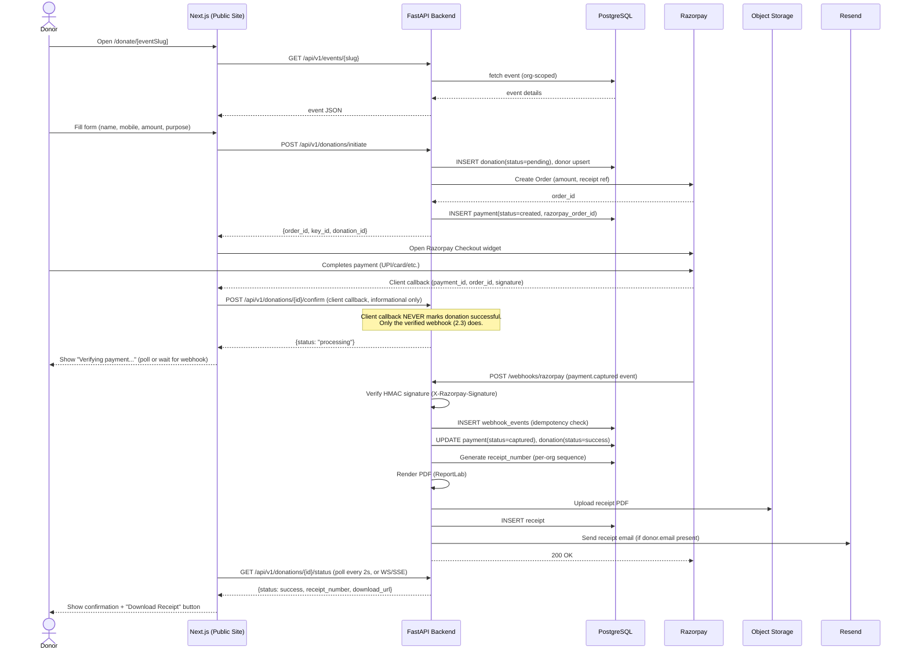
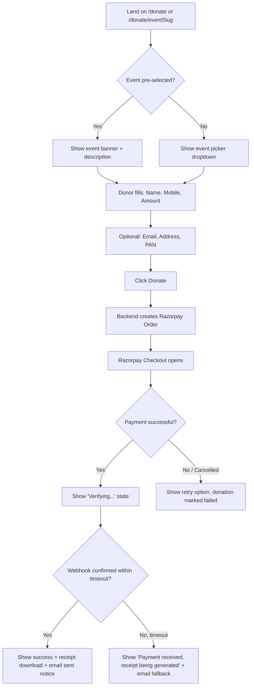
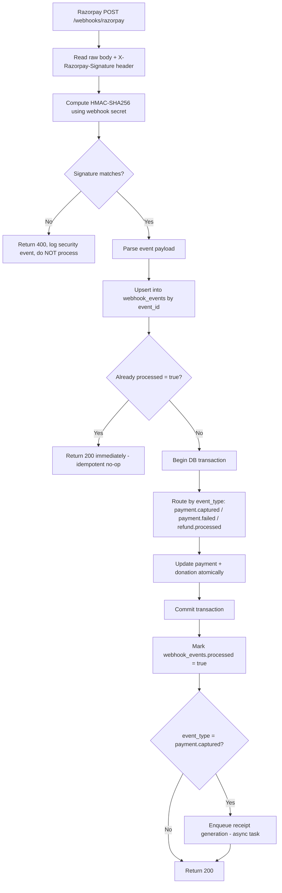
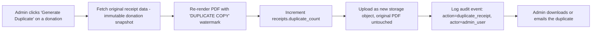

# 2. User Flow Diagrams

## 2.1 End-to-End Donation Flow (Happy Path)



## 2.2 Donation Page User Flow (Frontend Steps)



## 2.3 Authentication Flow (Admin Dashboard)

Implemented natively in FastAPI (`app/core/security.py`, `app/services/auth_service.py`, `app/api/v1/admin/auth.py`) — no Better Auth/Clerk dependency. See [05-architecture.md](05-architecture.md) for why this superseded the original brief's "Better Auth or Clerk" line: the backend is the single source of truth for `admin_users` + RBAC, so a second auth system would just be a second thing to keep in sync.

```mermaid
sequenceDiagram
    actor Admin
    participant Web as Next.js Admin
    participant API as FastAPI (app/api/v1/admin/auth.py)
    participant DB as PostgreSQL

    Admin->>Web: Visit /admin/login
    Admin->>Web: Submit email + password
    Web->>API: POST /api/v1/auth/login
    API->>DB: Look up admin_users by email
    DB-->>API: user record + roles (joined via admin_user_roles)
    API->>API: bcrypt.checkpw(password, password_hash)
    API->>API: Issue access JWT (30 min) + refresh JWT (7 days)
    API-->>Web: {access_token} in body; refresh_token as httpOnly cookie (path=/api/v1/auth)
    Web->>API: Subsequent requests: Authorization: Bearer <access_token>
    API->>API: get_current_admin() decodes JWT, extracts org_id + roles
    API->>API: require_role(...) checks caller's roles against the route's allowed roles
    API->>DB: Query scoped to org_id (never accepted from the request)
    DB-->>API: authorized data
    API-->>Web: response

    Note over Web,API: On 401 (expired access token), Web calls POST /auth/refresh<br/>(refresh_token cookie sent automatically) to get a new access token,<br/>and a rotated refresh token/cookie.
```

**Key rules (as implemented):**
- JWT claims: `sub` (admin_user_id), `org_id`, `roles[]`, `type` (`access`|`refresh`), `iat`/`exp` as numeric Unix timestamps, `jti`. Encoded/decoded in `app/core/security.py`.
- The refresh token is delivered as an `httpOnly`, `SameSite=Lax` cookie scoped to `/api/v1/auth` — never readable from JS, never sent to unrelated routes.
- Refresh rotates the token on every use (`auth_service.refresh`). **Known limitation**: there is no server-side revocation list keyed by `jti` yet, so a stolen refresh token remains valid until its natural 7-day expiry even after rotation — tracked in [06-deployment-security.md](06-deployment-security.md) as a hardening follow-up, not silently promised as done.
- CSRF: admin state-changing requests authenticate via the `Authorization: Bearer` header (not an ambient cookie), which is inherently immune to classic CSRF — a cross-site form/script can't read `localStorage`/JS-held tokens to attach that header. The refresh cookie itself is `SameSite=Lax`, which blocks it from being sent on cross-site POSTs.
- Every protected route uses `require_role(*roles)` (`app/core/rbac.py`), which depends on `get_current_admin` (`app/deps.py`) — this is the only place `organization_id` is extracted from a request for admin routes, and it always comes from the verified JWT, never from the request body/query.
- Public donor-facing endpoints are unauthenticated by design but rate-limited (`POST /donations/initiate`: 10/min/IP via `slowapi`).
- 2FA is designed for (`admin_users.two_factor_enabled` column exists) but not yet implemented — roadmap item.

## 2.4 Payment Flow (Detail)

```mermaid
flowchart LR
    A[POST /donations/initiate] --> B[Create donor record if new]
    B --> C[Create donation row: status=pending]
    C --> D[Call Razorpay Orders API]
    D --> E[Create payment row: status=created]
    E --> F[Return order_id + Razorpay key_id to client]
    F --> G[Client opens Razorpay Checkout]
    G --> H{Donor completes payment}
    H -->|Success| I[Razorpay fires payment.authorized then payment.captured webhooks]
    H -->|Failure| J[Razorpay fires payment.failed webhook]
    I --> K[Webhook handler verifies signature]
    J --> K
    K --> L{Signature valid?}
    L -- No --> M[Log + reject 400, alert]
    L -- Yes --> N{Event already processed? webhook_events.event_id}
    N -- Yes --> O[Return 200, no-op]
    N -- No --> P[Update payment + donation status]
    P --> Q{Status = captured?}
    Q -- Yes --> R[Trigger Receipt Generation Flow]
    Q -- No, failed --> S[Mark donation failed, no receipt]
```



## 2.5 Webhook Processing Flow (Robustness Detail)



**Notes:**
- Webhook endpoint must respond within Razorpay's timeout (~5s); receipt PDF generation + email are dispatched to a background task (FastAPI `BackgroundTasks` for v1; upgradeable to a proper queue like Celery/RQ or Supabase Edge Functions if volume grows — see roadmap) so the webhook response isn't blocked on PDF rendering or SMTP latency.
- All webhook processing wrapped in a single DB transaction so a partial failure (e.g. crash after updating `payment` but before `donation`) can't happen.

## 2.6 PDF Receipt Generation Flow

```mermaid
flowchart TD
    A[Trigger: donation.status -> success] --> B[Fetch org branding: logo, signature, receipt_prefix]
    B --> C[Allocate next receipt_number for org + financial_year]
    C --> D[Build ReportLab document: header, donor block, amount, purpose, footer]
    D --> E[Render to PDF bytes in-memory]
    E --> F[Upload to Object Storage: receipts/{org_id}/{receipt_number}.pdf]
    F --> G[INSERT receipts row: receipt_number, pdf_storage_key]
    G --> H{Donor has email?}
    H -- Yes --> I[Trigger Email Workflow]
    H -- No --> J[Skip email, available for download only]
    I --> K[Donor can download from confirmation page and /admin]
    J --> K
```

**Implementation note**: the current receipt template (`app/services/pdf/receipt_pdf.py`) renders org name, receipt number, date, donor details, amount (figures + words), purpose, payment/order IDs, a signature line, and the thank-you message — matching the brief's required field list. Embedding the org's actual logo/signature *images* (vs. the text placeholder line) is deferred to the admin-dashboard pass, once org branding upload exists. Amounts in the PDF render as "Rs. 1,500.00" rather than "₹1,500.00": ReportLab's base-14 Helvetica font (used for portability — no font file to embed or ship) has no glyph for the Rupee sign (U+20B9), which otherwise renders as a missing-glyph box. Web and email displays keep the ₹ symbol, since browsers and mail clients render it correctly.

## 2.7 Email Workflow

```mermaid
sequenceDiagram
    participant API as FastAPI
    participant Store as Object Storage
    participant Resend as Resend API
    actor Donor

    API->>Store: Fetch/generate signed URL for receipt PDF
    API->>Resend: POST /emails (to, subject, html template, attachment or link)
    Resend-->>API: {id: email_id, status: queued}
    API->>API: UPDATE receipts.emailed_at = now()
    Resend->>Donor: Delivers email with receipt (attached PDF or secure download link)
    Note over API,Resend: Failure handling: Resend webhook (bounce/complaint)<br/>logged to audit_logs; admin can manually "Resend receipt"<br/>from /admin/donations/[id].
```

- Email template: org-branded HTML (logo, thank-you message, donation summary, PDF attached — or a secure, expiring download link if attachment size/deliverability is a concern).
- "Resend receipt" admin action reuses this exact flow, logged in `audit_logs` with actor = admin user.

## 2.8 Duplicate Receipt Flow


