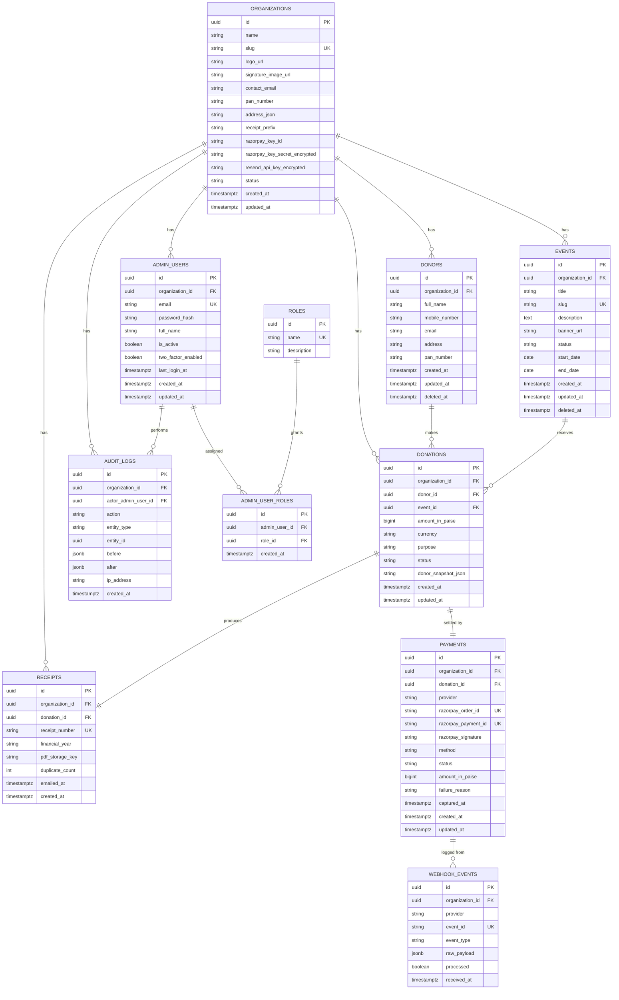

# 3. Database Schema & ER Diagram

PostgreSQL, managed via SQLAlchemy 2.0 models + Alembic migrations. Every core table carries `organization_id` for multi-tenant isolation, even though v1 runs a single organization.

## 3.1 Design Principles

1. **Tenant isolation by column, not by schema/DB** — simplest to operate at this scale; enforced via a mandatory `organization_id` filter in the repository/query layer (never trust the client for this — derive it from the authenticated session or the event/org context on public pages).
2. **UUID primary keys** (`uuid` v4 / `uuid_generate_v7()` if available) — safe to expose in URLs, no enumeration, merge-friendly across environments.
3. **Money as integer paise/cents** (`amount_in_paise BIGINT`), never floats — avoids rounding errors, matches Razorpay's native unit.
4. **Soft deletes** (`deleted_at TIMESTAMPTZ NULL`) on donor/event/user records — donations and receipts are financial records and are **never** hard-deleted.
5. **Append-only audit log** — no updates/deletes permitted on `audit_logs` at the application layer.
6. **Timestamps**: `created_at`, `updated_at` (UTC, `TIMESTAMPTZ`) on every table via a shared mixin.
7. **Enums as Postgres native enums** (via SQLAlchemy `Enum`) for status fields — self-documenting, indexed efficiently.

## 3.2 Entity List

- `organizations`
- `admin_users`
- `roles` (lookup) / `admin_user_roles` (join, allows future multi-role per user)
- `donors`
- `events`
- `donations`
- `payments`
- `receipts`
- `audit_logs`
- `webhook_events` (Razorpay event log, for idempotency + debugging)

## 3.3 ER Diagram



## 3.4 Table Notes

### `organizations`
- `slug` drives subdomain/path-based tenant routing later (e.g. `app.tld/o/{slug}` or `{slug}.app.tld`).
- Secrets (`razorpay_key_secret`, `resend_api_key`) stored **encrypted at the application layer** (e.g. via `cryptography.Fernet` with a key from the platform's own secret manager, not the DB) — the DB column holds ciphertext only. In v1 (single org) these may instead simply live in backend environment variables, with the DB columns nullable/unused, to reduce complexity; the columns exist so a real multi-tenant rollout doesn't require a migration.

### `admin_users` / `roles` / `admin_user_roles`
- Many-to-many via join table even though v1 UI assigns one role per user — avoids a future migration when a user needs two roles (e.g. `treasurer` + `coordinator`).
- `roles` seeded via migration: `super_admin`, `admin`, `treasurer`, `coordinator`, `viewer`.

### `donors`
- Unique-ish identity key is `(organization_id, mobile_number)` — enforced via a partial unique index (`WHERE deleted_at IS NULL`) — used to dedupe/upsert on each donation.
- Email/address/PAN nullable per the brief.

### `events`
- `slug` unique per organization (`UNIQUE(organization_id, slug)`), used to build `/donate/[slug]`.
- `status`: `draft | active | closed`.

### `donations`
- `status`: `pending | success | failed | refunded`. Row is created in `pending` at Razorpay-order-creation time and flipped to `success` only by the verified webhook handler.
- `donor_snapshot_json` freezes the donor's name/mobile/PAN *as entered for this donation* — donor records can be edited later (e.g. corrected address) without altering historical receipts, which must reflect what was true at donation time.
- `event_id` nullable — supports a general "unrestricted fund" donation not tied to a specific event.

### `payments`
- 1:1 with `donations` in v1 (one order per donation; no split/partial payments). Modeled as its own table (not columns on `donations`) so a future retry/partial-payment flow doesn't require restructuring.
- `razorpay_order_id` and `razorpay_payment_id` unique — also the natural idempotency keys.

### `receipts`
- `receipt_number` format: `{organization.receipt_prefix}/{financial_year}/{zero_padded_sequence}`, e.g. `ACME/2026-27/000123`. Sequence generated via a per-org, per-financial-year Postgres sequence (or a `SELECT ... FOR UPDATE` on a counter row) to guarantee gap-free-enough, monotonic numbering required for 80G compliance.
- `duplicate_count` increments each time "generate duplicate" is used; duplicate PDFs are watermarked and also logged to `audit_logs`.

### `audit_logs`
- Insert-only. `before`/`after` are JSONB diffs of the entity being mutated. No foreign key `ON DELETE CASCADE` from entities into audit_logs — logs must outlive the record they describe (soft-delete only).

### `webhook_events`
- Every inbound Razorpay webhook is persisted **before** processing, keyed by Razorpay's `event_id`, so a redelivered event is a no-op (`processed = true` short-circuits reprocessing). This is the idempotency backbone for FR-2.3.

## 3.5 Key Indexes

```sql
CREATE UNIQUE INDEX ux_donors_org_mobile ON donors (organization_id, mobile_number) WHERE deleted_at IS NULL;
CREATE UNIQUE INDEX ux_events_org_slug ON events (organization_id, slug);
CREATE INDEX ix_donations_org_created_at ON donations (organization_id, created_at DESC);
CREATE INDEX ix_donations_org_status ON donations (organization_id, status);
CREATE INDEX ix_donations_event_id ON donations (event_id);
CREATE INDEX ix_donations_donor_id ON donations (donor_id);
CREATE UNIQUE INDEX ux_receipts_number ON receipts (receipt_number);
CREATE UNIQUE INDEX ux_payments_razorpay_order ON payments (razorpay_order_id);
CREATE UNIQUE INDEX ux_payments_razorpay_payment ON payments (razorpay_payment_id) WHERE razorpay_payment_id IS NOT NULL;
CREATE UNIQUE INDEX ux_webhook_events_event_id ON webhook_events (provider, event_id);
CREATE INDEX ix_audit_logs_org_created_at ON audit_logs (organization_id, created_at DESC);
```

## 3.6 Migration Strategy

- Alembic autogenerate from SQLAlchemy models; every migration reviewed manually (autogenerate misses partial indexes, check constraints, and enum alterations).
- Naming: `YYYYMMDDHHMM_short_description.py`.
- Seed data (roles, a default organization for local dev) via a dedicated `alembic/seed.py` invoked post-migration, not baked into schema migrations.
