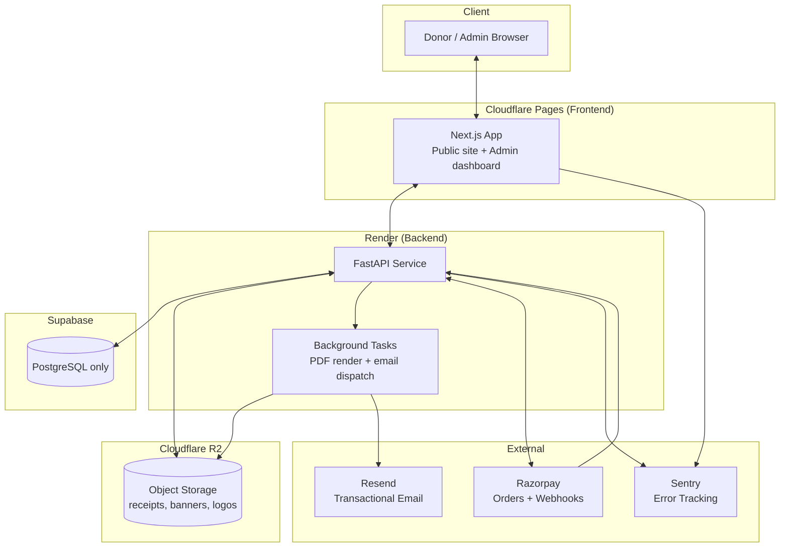

# 5. Architecture

## 5.1 System Architecture Overview

**Chosen for this deployment** (see [docs/09-session-handoff.md](09-session-handoff.md) §2): Cloudflare Pages (frontend), Render (backend), Supabase (Postgres only), Cloudflare R2 (object storage) — not Supabase Storage. None of this is connected/live yet.



Single deployable backend service in v1 (no separate microservices) — a modular monolith. Multi-tenancy is handled at the data-access layer, not via separate deployments per org.

## 5.2 Backend Architecture (FastAPI)

**Layering** (dependency direction flows downward only):

```
API Routers (HTTP concerns: request/response, status codes)
   ↓
Services (business logic: "confirm a payment", "generate a receipt")
   ↓
Repositories (data access: SQLAlchemy queries, always org-scoped)
   ↓
Models (SQLAlchemy ORM models)
```

- **Routers** never contain business logic or raw SQLAlchemy queries — they parse/validate (Pydantic), call a service, and shape the HTTP response.
- **Services** are plain Python classes/functions, framework-agnostic — testable without spinning up FastAPI. This is where "verify webhook signature," "allocate receipt number," "render PDF" live.
- **Repositories** are the only layer that touches `Session`/SQL. Every repository method takes `organization_id` as an explicit, non-optional parameter (never inferred implicitly) — this is the primary defense against cross-tenant data leaks.
- **Dependency Injection**: FastAPI `Depends()` provides `db: Session`, `current_admin: AdminUser` (with `.organization_id`, `.roles`), and `current_org` (resolved from JWT for admin routes, from event/org slug for public routes).
- **Background work**: FastAPI `BackgroundTasks` for v1 (receipt PDF + email are dispatched after the webhook responds). If donation volume grows enough that in-process background tasks risk being dropped on deploy/restart, promote to a durable queue (Celery/RQ + Redis, or a Supabase Edge Function/cron) — flagged in the roadmap, not built prematurely.
- **Config**: `pydantic-settings`, all secrets from environment variables, validated at startup (fail fast if a required secret is missing).

## 5.3 Frontend Architecture (Next.js App Router)

Both route groups below are built: `(public)` (donor-facing, Server Components, SSR event data) and `(admin)` (the dashboard, client-heavy, its own auth stack). §5.4's folder tree marks the few remaining gaps.

- **Two route groups** in one Next.js app: `(public)` for donor-facing pages and `(admin)` for the dashboard.
- **Server Components by default in `(public)`**; the entire `(admin)` tree is Client Components, since every admin page needs the in-memory access token (`lib/auth.ts`) to call the API — there's no server-side session to render from (see the route-protection note below for why).
- **Data fetching**: `(public)` Server Components fetch directly from the FastAPI backend via `lib/api-client.ts`, a thin fetch wrapper matching the backend's `{data, error}` envelope, with request-level types hand-maintained in `types/api.ts` (see note below). Every call defaults to `cache: "no-store"` — event/donation state must never be served stale. `(admin)` pages use `lib/auth.ts`'s `adminApiClient`, which layers Bearer-token attachment and one-shot refresh-and-retry-on-401 on top of the same envelope.
  - *Deviation from the original plan*: types are hand-written rather than generated from the OpenAPI schema via `openapi-typescript`. Worth adding once the API surface stabilizes — flagged, not silently dropped.
- **State management**: no React Query. Every admin list page (`donations`, `events`, `donors`, `users`, `audit-logs`) uses the same small pattern — `useState` + a `load()` callback in `useEffect` — which was enough for this pass's data volume and avoided pulling in a caching library the pages don't yet need. Revisit if/when admin tables need request dedup across components or optimistic updates.
- **Styling**: Tailwind CSS v4 (`@theme inline` tokens in `globals.css`) + shadcn/ui (Radix base, Nova preset) — the default palette was replaced with a custom indigo/amber theme in `globals.css`, in both light and dark variants; **not** left at shadcn defaults.
- **Route protection is client-side, not `proxy.ts`** — a real architectural decision, not an oversight. Next.js 16 renamed `middleware.ts` to `proxy.ts`, and the natural design would have it redirect unauthenticated `/admin/*` requests server-side. It doesn't work here: the refresh-token cookie is set by the **backend's** origin (`localhost:8000` in dev) with `path=/api/v1/auth`, while the Next.js server (where `proxy.ts` / Server Components run) only ever sees cookies sent to **its own** origin on the **current request's path** — a request for `/admin/dashboard` never carries a cookie scoped to a different origin and a different path. Making server-side gating work would require either a same-origin rewrite proxy for all API calls *plus* a second, non-path-restricted "is logged in" cookie, or a full BFF layer — real future options, not worth the complexity here. Instead, `components/admin/AuthProvider.tsx` calls `GET /auth/me` on mount and `components/admin/AdminGuard.tsx` redirects client-side if that fails. This is UX, not the security boundary — every admin API call is re-checked server-side by `require_role` regardless of what the frontend renders.

## 5.4 Folder Structure

### Backend (`backend/`)

✅ built · ○ planned (see [07-roadmap.md](07-roadmap.md))

```
backend/
├── alembic/
│   ├── versions/                     ✅ 0001 initial schema, 0002 revoked_refresh_tokens
│   └── env.py                        ✅
├── scripts/                          ✅ seed.py, simulate_webhook.py — see note below
├── app/
│   ├── main.py                       ✅ FastAPI app, CORS, security headers, exception handlers
│   ├── config.py                     ✅ pydantic-settings, fail-fast on missing required vars
│   ├── database.py                   ✅ engine, session factory
│   ├── deps.py                       ✅ get_db, get_current_admin, get_public_organization
│   │
│   ├── models/                       ✅ all 12 tables from docs/03-database-schema.md
│   │   ├── organization.py, admin_user.py, admin_user_role.py, role.py,
│   │   ├── donor.py, event.py, donation.py, payment.py,
│   │   └── receipt.py (+ ReceiptCounter), audit_log.py, webhook_event.py, revoked_token.py
│   │
│   ├── schemas/                      ✅ auth.py, common.py, donation.py (incl. DonorInput), event.py,
│   │                                    donor.py, dashboard.py, admin_user.py, audit_log.py, organization.py
│   │
│   ├── repositories/                 ✅ donation_repo, donor_repo, event_repo, receipt_repo,
│   │                                    admin_user_repo, audit_log_repo, organization_repo, revoked_token_repo
│   │
│   ├── services/                     ✅ donation_service, payment_service (Razorpay),
│   │   │                                webhook_service, receipt_service, auth_service, audit_service,
│   │   │                                email_service (Resend), storage_service (Local/R2/Supabase —
│   │   │                                  R2 is this deployment's chosen backend, untested against a
│   │   │                                  real bucket; see docs/09-session-handoff.md),
│   │   │                                amount_in_words.py, format_utils.py
│   │   ├── pdf/receipt_pdf.py         ✅ ReportLab template
│   │   └── pdf/report_pdf.py          ○ summary reports (with export_service.py) — CSV export ✅ lives in the reports router directly, no separate service needed for that
│   │
│   ├── api/v1/
│   │   ├── router.py                 ✅
│   │   ├── public/events.py, donations.py, receipts.py   ✅
│   │   ├── webhooks/razorpay.py       ✅
│   │   └── admin/
│   │       ├── auth.py               ✅ login / refresh / logout / me
│   │       └── dashboard.py, donations.py, donors.py, events.py,
│   │           reports.py, users.py, audit_logs.py, organization.py   ✅ all built
│   │
│   ├── core/
│   │   ├── security.py               ✅ JWT (numeric iat/exp!) + bcrypt
│   │   ├── rbac.py                   ✅ require_role(*roles) dependency
│   │   ├── rate_limit.py             ✅ slowapi
│   │   └── exceptions.py             ✅ AppError hierarchy -> HTTP envelope
│   │
│   └── worker/tasks.py               ✅ generate_receipt_and_email — own DB session,
│                                          dispatched via FastAPI BackgroundTasks from the webhook route
│
├── tests/
│   ├── unit/                         ✅ webhook signature, receipt numbering (incl. concurrency), PDF render
│   └── integration/                  ✅ donation->webhook->receipt flow, auth/audit flow,
│                                          admin-endpoint security sweep (RBAC + cross-org isolation) —
│                                          75 tests total
│
├── var/receipts/                     local-dev-only PDF storage (gitignored)
├── alembic.ini, pyproject.toml, requirements.txt
├── .env.example, Dockerfile, .dockerignore
```

**Note on `scripts/`**: seed/dev-tooling scripts live in their own top-level `scripts/` package, deliberately **not** under `alembic/` — a module named `alembic/seed.py` collides with the installed `alembic` library's own package name (`python -m alembic.seed` resolves `alembic` to the real library first and fails); a real bug hit and fixed during this build, documented in [08-local-development.md](08-local-development.md).

### Frontend (`frontend/`)

✅ built · ○ planned (see [07-roadmap.md](07-roadmap.md))

```
frontend/
├── src/
│   ├── app/
│   │   ├── (public)/                              ✅
│   │   │   ├── layout.tsx                         ✅ header/footer shell
│   │   │   ├── donate/
│   │   │   │   ├── page.tsx                       ✅ general donation form
│   │   │   │   ├── [eventSlug]/
│   │   │   │   │   ├── page.tsx                   ✅ event donation form (SSR event fetch)
│   │   │   │   │   └── not-found.tsx              ✅ styled 404 for expired/bad event links
│   │   │   │   └── confirmation/[donationId]/page.tsx  ✅ polls status, shows receipt
│   │   │   └── events/[eventSlug]/page.tsx         ○ standalone public event details page (covered for now by the donation form itself showing the event banner/description inline)
│   │   │
│   │   ├── (admin)/                                ✅ all built
│   │   │   └── admin/
│   │   │       ├── layout.tsx                      ✅ AuthProvider wrapper (shared by login + protected pages)
│   │   │       ├── login/page.tsx                  ✅
│   │   │       └── (protected)/
│   │   │           ├── layout.tsx                  ✅ AdminGuard + AdminSidebar shell
│   │   │           ├── page.tsx                    ✅ dashboard home (KPIs + recent donations)
│   │   │           ├── donations/{page.tsx,[id]/page.tsx}  ✅ list w/ filters, detail w/ resend+duplicate
│   │   │           ├── donors/{page.tsx,[id]/page.tsx}     ✅
│   │   │           ├── events/{page.tsx,new/,[id]/edit/}   ✅ list+create+edit+delete
│   │   │           ├── reports/page.tsx            ✅ CSV export with filters
│   │   │           ├── users/page.tsx              ✅ create/edit roles/toggle active
│   │   │           ├── audit-logs/page.tsx         ✅
│   │   │           └── settings/page.tsx           ✅ org profile fields
│   │   │
│   │   ├── layout.tsx                              ✅ root layout, ThemeProvider, Toaster
│   │   ├── page.tsx                                ✅ redirects "/" -> "/donate"
│   │   └── proxy.ts                                ○ deliberately not built — see the client-side-auth note in lib/auth.ts and §5.3
│   │
│   ├── components/
│   │   ├── ui/                                     ✅ shadcn/ui primitives (incl. table, dialog, alert-dialog, switch)
│   │   ├── donation/                               ✅ DonationForm, AmountPicker, EventBanner, PaymentStatusPoller
│   │   ├── theme-provider.tsx                       ✅ next-themes wrapper
│   │   └── admin/                                  ✅ AuthProvider, AdminGuard (+ RequireRole), AdminSidebar,
│   │                                                    KpiCard, Pagination, EventForm, UserFormDialog
│   │
│   ├── lib/
│   │   ├── api-client.ts                  ✅ {data,error}-envelope fetch wrapper, cache:"no-store" + credentials:"include" default
│   │   ├── razorpay.ts                    ✅ Checkout script loader/invoker (client-only)
│   │   ├── format.ts                      ✅ currency/date formatting
│   │   └── auth.ts                        ✅ token storage/attach + refresh-on-401 + blob download helper (native JWT, not Better Auth)
│   │
│   ├── hooks/
│   │   └── use-donation-status-poll.ts    ✅ (React Query not introduced — see §5.3 deviation note; admin pages use plain fetch-in-effect, which was enough for this pass's data volume)
│   │
│   └── types/
│       └── api.ts                          ✅ hand-maintained, public + admin types (see §5.3 deviation note)
│
├── public/
├── tailwind.config.ts / next.config.ts
├── .env.example / .env.local
└── package.json
```

## 5.5 Suggested Git Repository Structure

**Monorepo** (recommended for v1 — one org, tightly coupled frontend/backend, single small team):

```
donation-platform/
├── frontend/            # Next.js app
├── backend/             # FastAPI app
├── docs/                # this documentation set
├── infra/               # IaC snippets, Dockerfiles, render.yaml / railway.json
├── .github/
│   └── workflows/
│       ├── frontend-ci.yml
│       ├── backend-ci.yml
│       └── deploy.yml
├── .gitignore
└── README.md
```

Branching model: **trunk-based with short-lived feature branches**.
- `main` — always deployable, protected, requires PR + passing CI.
- `feature/<ticket>-short-description`
- `fix/<ticket>-short-description`
- Tags `v{major}.{minor}.{patch}` on each production deploy (semantic versioning, even pre-1.0 as `0.x.y`).

Commit convention: **Conventional Commits** (`feat:`, `fix:`, `chore:`, `docs:`, `refactor:`, `test:`) — enables automated changelog generation later.

## 5.6 Coding Standards & Conventions

### Python / Backend
- Formatter/linter: `ruff` (format + lint), `mypy` in strict mode for `app/services` and `app/repositories` at minimum.
- Naming: `snake_case` for functions/variables, `PascalCase` for classes, modules named after the aggregate they own (`donation_service.py`, not `service2.py`).
- Every Pydantic schema explicitly separates `Create`/`Update`/`Read` variants — never reuse an ORM model as a response schema directly.
- No bare `except:`; always catch specific exceptions and re-raise as a typed app exception (`app.core.exceptions`) mapped to an HTTP status in one place.
- All money amounts are `int` (paise) end-to-end in the backend; conversion to rupees for display happens only in the frontend/PDF layer.
- Every repository method signature starts with `(db: Session, organization_id: UUID, ...)` — enforced by convention + reviewed in PRs; consider a lint rule/test that greps for repository methods missing this parameter.

### TypeScript / Frontend
- Formatter/linter: `eslint` + `prettier`, `strict: true` in `tsconfig.json`.
- No `any` — use generated API types or explicit interfaces.
- Server Components are the default; add `"use client"` only when a component needs state, effects, or browser APIs.
- Co-locate component + its test (`DonationForm.tsx`, `DonationForm.test.tsx`).
- Currency always formatted via `lib/format.ts#formatInr()` — never inline `₹${amount}`.

### Cross-cutting
- PRs require: passing CI (lint, typecheck, tests), at least one review, and a description linking the requirement/ticket.
- No secrets committed — enforced via `.env.example` (committed, empty values) + `.gitignore` for actual `.env`, and a pre-commit secret-scanner (e.g. `gitleaks`) in CI.
- Database migrations reviewed as their own PR commit, never squashed silently into a feature commit.
