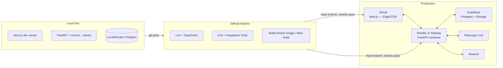

# 6. Deployment Architecture & Security

## 6.1 Deployment Architecture

- **Environments**: `local` → `staging` → `production`. Staging uses Razorpay **test mode** keys and a separate Supabase project/branch.
- **Frontend (Vercel)**: automatic preview deployments per PR; production deploy on merge to `main`. Environment variables (API base URL) set per-environment in Vercel dashboard. No auth-provider config to set here — auth is native FastAPI JWT (see [05-architecture.md](05-architecture.md)), not a third-party provider.
- **Backend (Render/Railway)**: Dockerized FastAPI, health check endpoint (`/healthz`) for zero-downtime deploys, auto-deploy on `main` push after CI passes. Horizontal scaling: stateless app instances behind the platform's load balancer (no in-memory session state — sessions are JWT/DB-backed).
- **Database (Supabase Postgres)**: automated daily backups (Supabase built-in), point-in-time recovery on paid tier, connection pooling via Supabase's PgBouncer for serverless-friendly connection counts.
- **Object Storage**: Supabase Storage buckets — `receipts` (private, signed-URL access only), `branding` (public-read, for logos/banners).
- **Secrets management**: platform-native env var stores (Vercel/Render/Railway secrets) for v1; documented as a straightforward swap to a dedicated secret manager (e.g. Doppler, AWS Secrets Manager) if/when multi-org scaling warrants it.
- **DNS/TLS**: TLS terminated at Vercel/Render edge by default; custom domain + managed cert when the org's own domain is attached.

## 6.2 CI/CD Pipeline

1. **On PR**: lint (ruff/eslint) → typecheck (mypy/tsc) → unit tests → integration tests (spun-up test Postgres via GitHub Actions service container) → build check.
2. **On merge to `main`**: same checks (guard against a bad direct push) → Alembic migration run against staging → deploy backend to staging → smoke test (`/healthz`, a scripted donation-flow test against Razorpay test mode) → manual promote to production (or auto-promote once confidence is established).
3. **Migrations**: run as a separate CI/CD step (`alembic upgrade head`) before the new backend version receives traffic — never run implicitly on app boot in production (avoids concurrent-instance race conditions during rolling deploys).

## 6.3 Security Best Practices

Everything below is implemented and covered by `tests/integration/test_auth_flow.py` and `test_admin_endpoints_security.py` unless marked ○.

### Authentication & Session Security
- Passwords hashed with `bcrypt` (never reversible encryption).
- JWT access tokens short-lived (30 min), numeric `iat`/`exp` (RFC 7519 NumericDate — encoding these as ISO strings instead is a real bug this build hit and fixed; see [08-local-development.md](08-local-development.md)).
- Refresh tokens: httpOnly, `Secure` in any non-dev/test environment, `SameSite=Lax`, delivered scoped to `path=/api/v1/auth`. **Rotated and revoked on every use** — `revoked_refresh_tokens` records the exchanged token's `jti`, so even a copied-but-not-yet-used refresh token stops working the moment the legitimate client refreshes. `POST /auth/logout` revokes explicitly.
- ○ TOTP-based 2FA for admin accounts — `admin_users.two_factor_enabled` column exists; the actual TOTP flow isn't built (roadmap item).
- ○ Account lockout / exponential backoff after repeated failed logins — only flat rate limiting exists today (5/min/IP on login, see below), not per-account backoff.

### Authorization
- RBAC enforced **server-side** on every admin route via a FastAPI dependency (`require_role(...)`) — frontend route guards (`AdminGuard`/`RequireRole`) are UX only, never the security boundary. Verified by a dedicated security-sweep test file that hits every admin endpoint with no auth, garbage auth, and each disallowed role, asserting 401/403 — not just reviewed by inspection.
- Every query is org-scoped by construction (repository layer requires `organization_id`); no endpoint accepts a client-supplied `organization_id` that overrides the authenticated session's org. Verified by tests that insert data into a second organization and assert it's neither visible nor mutable from the first org's admin session (events, donations, dashboard totals, user management).
- A `super_admin` cannot deactivate their own account or remove their own `super_admin` role via `PATCH /admin/users/{id}` — a self-lockout guard, not strictly required by the role matrix but cheap and worth having.

### Input Validation & Injection Protection
- All input validated via Pydantic schemas at the API boundary (type, length, format — e.g. PAN regex, mobile number format, event slug format).
- SQL injection: SQLAlchemy ORM/Core with parameter binding exclusively — no raw string-interpolated SQL, ever.
- ○ File uploads (event banners, org logo/signature): not built — these are plain URL string fields today (an admin pastes a link), not a multipart upload. When real upload is added: validate MIME type + magic bytes (not just extension), enforce size limits, store with generated filenames (never trust client filename), scan-ready hook point if AV scanning is added later.

### CSRF
- Admin state-changing requests authenticate via `Authorization: Bearer <access_token>`, not an ambient cookie — a cross-site page has no way to read the token out of the frontend's `localStorage`/JS memory to attach that header, which is inherently CSRF-resistant (no token to forge with, unlike cookie-based auth). The one cookie involved (`refresh_token`) is `SameSite=Lax`, which blocks it from being sent on cross-site `POST`s to `/auth/refresh` anyway.
- Public donation endpoints are inherently "write" from anonymous users by design — protected instead by rate limiting + Razorpay's own fraud checks, not CSRF tokens (there's no authenticated session to forge).

### Webhook Security
- Razorpay webhook signature (`X-Razorpay-Signature`) verified via HMAC-SHA256 against the raw request body **before** any parsing/processing.
- Webhook secret stored as a backend-only env var, distinct from the Razorpay API key/secret.
- Idempotency via `webhook_events.event_id` unique constraint — replay-safe.
- Optionally allowlist Razorpay's published webhook source IPs at the infra/firewall level as defense-in-depth (signature verification remains the primary control).

### Rate Limiting & Abuse Prevention
- Flat per-IP limits (via `slowapi`, in-memory storage) on `POST /donations/initiate` (10/min) and `POST /auth/login` (5/min) — see [04-api-specification.md](04-api-specification.md#45-rate-limiting). ○ Per-identity (mobile number) limits are not implemented, only per-IP.
- ○ CAPTCHA/Turnstile on the public donation form — kept out of v1 by default to minimize donor friction; add if abuse patterns are observed.

### Data Protection
- TLS enforced end-to-end (browser↔Vercel, Vercel↔Render, Render↔Supabase — all HTTPS/SSL) — applies once actually deployed; not yet deployed anywhere (see [07-roadmap.md](07-roadmap.md)).
- PII (PAN, address, mobile) — Supabase Postgres encryption-at-rest (platform-level); consider column-level encryption for PAN specifically if compliance requirements tighten.
- Signed, short-expiry URLs for receipt PDF downloads via `SupabaseStorage.get_signed_url()` when Supabase is configured; `LocalFilesystemStorage` (local dev, no Supabase credentials) instead serves from `GET /receipts/local-file/{key}` with no signature — acceptable for local-only dev, would need real signing before ever pointing at a public deployment.
- ○ The public `GET /receipts/{number}/download` endpoint itself doesn't yet require a signed token or mobile-verification param (see [04-api-specification.md](04-api-specification.md) §4.1) — reachable by receipt number alone, which is sequential/low-entropy. Tracked as a concrete hardening item, not silently dropped.

### Audit Logging
- Wired into real mutation paths, not just designed: `admin_login` / `admin_login_failed` (with the target account's org, never logged for an unrecognized email since there's no org to attribute it to), `donation_confirmed` / `donation_payment_failed` (system-triggered, `actor_admin_user_id=null`), `event_created` / `event_updated` / `event_deleted`, `receipt_resend_email`, `receipt_duplicate_generated`, `admin_user_created` / `admin_user_updated`, `organization_updated`. Each row: actor (nullable), action, entity, before/after JSON, IP, timestamp.
- Table is insert-only at the application layer (no `UPDATE`/`DELETE` service methods exposed) — `repositories/audit_log_repo.py` only ever queries it, and `services/audit_service.py`'s only mutating function is `record()`.
- Visible via `GET /admin/audit-logs` and an admin UI page, restricted to `super_admin`/`treasurer`.

### Error Handling
- Centralized exception handler maps internal exceptions to safe, generic client-facing messages (`INTERNAL_ERROR`) — stack traces and internal details never leak to the client; full detail goes to Sentry/structured logs only.
- Payment failures surface an actionable-but-non-technical message to the donor ("Payment could not be completed, please try again") while logging the Razorpay error code/description internally.

### Dependency & Supply Chain
- Automated dependency vulnerability scanning (`pip-audit` / `npm audit` or Dependabot) in CI.
- Pin dependency versions (lockfiles committed: `poetry.lock`/`uv.lock`, `package-lock.json`).

## 6.4 Monitoring & Observability

- **Error tracking**: Sentry on both frontend and backend, environment-tagged (staging vs. production).
- **Structured logging**: JSON logs from FastAPI (request id, org_id, admin_user_id where applicable) shippable to the hosting platform's log viewer or an external sink (e.g. Better Stack) later.
- **Uptime**: health-check endpoint monitored by an external pinger (e.g. UptimeRobot) hitting `/healthz` and the public `/donate` page.
- **Webhook delivery visibility**: `webhook_events` table itself doubles as a debugging log — admin can (future) view "recent webhook deliveries" for reconciliation.
