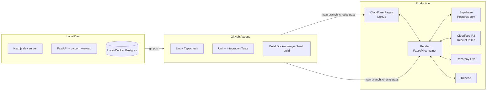

# 6. Deployment Architecture & Security

## 6.1 Deployment Architecture

**Chosen for this deployment** (see [docs/09-session-handoff.md](09-session-handoff.md) §2 — none of this is connected/live yet): Cloudflare Pages (frontend), Render (backend), Supabase (Postgres only), Cloudflare R2 (receipt PDF storage). The diagram below reflects this; earlier drafts of this doc mentioned Vercel/Railway/Supabase-Storage as generic options — superseded.

- **Environments**: `local` → `staging` → `production`. Staging uses Razorpay **test mode** keys and a separate Supabase project/branch.
- **Frontend (Cloudflare Pages)**: automatic preview deployments per PR; production deploy on merge to `main`. Environment variables (API base URL) set per-environment in the Cloudflare dashboard. No auth-provider config to set here — auth is native FastAPI JWT (see [05-architecture.md](05-architecture.md)), not a third-party provider. Standard Next.js (App Router, Server Components) needs Cloudflare's Next.js adapter for Pages — not yet set up, do this before first deploy.
- **Backend (Render)**: Dockerized FastAPI (`backend/Dockerfile`, builds/runs correctly — verified locally), health check endpoint (`/healthz`) for zero-downtime deploys, auto-deploy on `main` push after CI passes.
- **Frontend Dockerfile** (`frontend/Dockerfile`) also exists — multi-stage, Next.js `output: "standalone"`, built and smoke-tested against a real running container. Not the actual deployment path (Cloudflare Pages, via its own adapter) but available for local containerized parity or a future non-Cloudflare fallback.
- **Database (Supabase Postgres only — not Supabase Storage)**: connect via Supabase's **Session Pooler** connection string (port 5432, IPv4-compatible), not "Direct connection" (IPv6-only unless paying for an add-on — Render is IPv4). Automated daily backups (Supabase built-in), point-in-time recovery on paid tier.
- **Object Storage (Cloudflare R2)**: `R2Storage` in `app/services/storage_service.py` — S3-compatible, boto3-based, presigned URLs via `generate_presigned_url`. Chosen over Supabase Storage for zero egress fees and to avoid a cross-cloud hop from the Cloudflare-hosted frontend. Bucket kept **private** (receipts contain PAN/mobile numbers) — never expose the R2 access keys to the frontend, backend-only. **Not yet tested against a real R2 bucket** — verify with `backend/scripts/simulate_webhook.py` the moment real credentials are added.
- **Secrets management**: platform-native env var stores (Cloudflare/Render secrets) for v1; documented as a straightforward swap to a dedicated secret manager (e.g. Doppler, AWS Secrets Manager) if/when multi-org scaling warrants it.
- **DNS/TLS**: TLS terminated at Cloudflare/Render edge by default; custom domain + managed cert when the org's own domain is attached.

## 6.2 CI/CD Pipeline

**`.github/workflows/ci.yml` exists and runs on every push/PR to `main`** — two jobs:
- **Backend**: spins up a `postgres:16-alpine` service container, installs `requirements-dev.txt`, runs `ruff check` (hard gate — the codebase is fully clean against it), runs `mypy` (advisory only — `|| true` — the codebase has pre-existing strict-mode violations from before mypy was wired in; ruff is the real gate until that debt is paid down, see §6.3), runs `alembic upgrade head` against a fresh database (catches broken migrations independently of the test suite, which creates its schema via `Base.metadata.create_all` and wouldn't otherwise notice), then the full `pytest` suite.
- **Frontend**: `npm ci` → `npm run lint` → `npm run typecheck` (added as a proper script, previously only run ad hoc via `npx tsc --noEmit`) → `npm run build`.

Deployment automation (staging promotion, Render/Cloudflare Pages auto-deploy hooks) is not yet wired up — CI currently verifies the code, it doesn't yet ship it. That's the remaining piece of Milestone 6.

**Migrations**: run as a separate CI/CD step (`alembic upgrade head`) before the new backend version receives traffic — never run implicitly on app boot in production (avoids concurrent-instance race conditions during rolling deploys).

## 6.3 Security Best Practices

Everything below is implemented and covered by `tests/integration/test_auth_flow.py`, `test_two_factor_auth.py`, `test_admin_invite_flow.py`, `test_image_upload.py`, and `test_admin_endpoints_security.py` unless marked ○.

### Authentication & Session Security
- Passwords hashed with `bcrypt` (never reversible encryption).
- JWT access tokens short-lived (30 min), numeric `iat`/`exp` (RFC 7519 NumericDate — encoding these as ISO strings instead is a real bug this build hit and fixed; see [08-local-development.md](08-local-development.md)).
- Refresh tokens: httpOnly, `Secure` in any non-dev/test environment, `SameSite=Lax`, delivered scoped to `path=/api/v1/auth`. **Rotated and revoked on every use** — `revoked_refresh_tokens` records the exchanged token's `jti`, so even a copied-but-not-yet-used refresh token stops working the moment the legitimate client refreshes. `POST /auth/logout` revokes explicitly.
- **TOTP-based 2FA for admin accounts**: `POST /auth/2fa/setup` (generates a secret + QR, doesn't enable yet) → `POST /auth/2fa/enable` (requires a valid code to confirm) → login becomes two-step (`POST /auth/login` returns `mfa_required`+a short-lived `mfa_token` instead of real tokens; `POST /auth/login/verify-2fa` completes it). `POST /auth/2fa/disable` requires a valid code. See `app/services/totp_service.py`, `app/services/auth_service.py`.
- **Account lockout after repeated failed logins**: 5 consecutive failures (password OR TOTP code — both count against the same threshold) lock the account for 15 minutes (`admin_users.failed_login_attempts`/`locked_until`, tunable via `LOGIN_LOCKOUT_THRESHOLD`/`LOGIN_LOCKOUT_MINUTES`). The rejection message is identical to plain "invalid email or password" whether the account doesn't exist, the password is wrong, or the account is currently locked — a distinct "account locked" message would itself confirm the account exists, defeating the point.

### Authorization
- RBAC enforced **server-side** on every admin route via a FastAPI dependency (`require_role(...)`) — frontend route guards (`AdminGuard`/`RequireRole`) are UX only, never the security boundary. Verified by a dedicated security-sweep test file that hits every admin endpoint with no auth, garbage auth, and each disallowed role, asserting 401/403 — not just reviewed by inspection.
- Every query is org-scoped by construction (repository layer requires `organization_id`); no endpoint accepts a client-supplied `organization_id` that overrides the authenticated session's org. Verified by tests that insert data into a second organization and assert it's neither visible nor mutable from the first org's admin session (events, donations, dashboard totals, user management).
- A `super_admin` cannot deactivate their own account or remove their own `super_admin` role via `PATCH /admin/users/{id}` — a self-lockout guard, not strictly required by the role matrix but cheap and worth having.

### Input Validation & Injection Protection
- All input validated via Pydantic schemas at the API boundary (type, length, format — e.g. PAN regex, mobile number format, event slug format).
- SQL injection: SQLAlchemy ORM/Core with parameter binding exclusively — no raw string-interpolated SQL, ever.
- **File uploads** (event banners, org logo/signature — `POST /admin/events/{id}/banner`, `/admin/organization/logo`, `/admin/organization/signature`): real multipart upload through the existing storage adapter. `app/core/file_validation.py` checks actual magic bytes (PNG/JPEG/WEBP signatures), not the client-claimed Content-Type or filename extension; 5MB size cap; storage keys are always server-generated (`event-banners/{org_id}/{event_id}.{ext}`, `org-assets/{org_id}/{logo|signature}.{ext}`) — the client's filename is never used for anything. Served back through a new public `GET /assets/{key}` route that only ever serves the `event-banners/`/`org-assets/` prefixes (never `receipts/`, which stays behind the signed-token gate below).

### CSRF
- Admin state-changing requests authenticate via `Authorization: Bearer <access_token>`, not an ambient cookie — a cross-site page has no way to read the token out of the frontend's `localStorage`/JS memory to attach that header, which is inherently CSRF-resistant (no token to forge with, unlike cookie-based auth). The one cookie involved (`refresh_token`) is `SameSite=Lax`, which blocks it from being sent on cross-site `POST`s to `/auth/refresh` anyway.
- Public donation endpoints are inherently "write" from anonymous users by design — protected instead by rate limiting + Razorpay's own fraud checks, not CSRF tokens (there's no authenticated session to forge).

### Webhook Security
- Razorpay webhook signature (`X-Razorpay-Signature`) verified via HMAC-SHA256 against the raw request body **before** any parsing/processing.
- Webhook secret stored as a backend-only env var, distinct from the Razorpay API key/secret.
- Idempotency via `webhook_events.event_id` unique constraint — replay-safe.
- Optionally allowlist Razorpay's published webhook source IPs at the infra/firewall level as defense-in-depth (signature verification remains the primary control).

### Rate Limiting & Abuse Prevention
- Flat per-IP limits (via `slowapi`, in-memory storage) on `POST /donations/initiate` (10/min) and `POST /auth/login` (5/min) — see [04-api-specification.md](04-api-specification.md#45-rate-limiting).
- **Per-identity (mobile number) limiting**: `app/core/identity_rate_limit.py` — an independent in-memory sliding-window counter (10/hour per mobile number, tunable via `DONATION_IDENTITY_RATE_LIMIT_PER_HOUR`) closes the gap where per-IP limiting alone doesn't stop the same mobile number being targeted from many rotating IPs.
- ○ CAPTCHA/Turnstile on the public donation form — kept out of v1 by default to minimize donor friction; add if abuse patterns are observed.

### Data Protection
- TLS enforced end-to-end (browser↔Cloudflare Pages, Pages↔Render, Render↔Supabase, Render↔R2 — all HTTPS/SSL) — applies once actually deployed; not yet deployed anywhere (see [07-roadmap.md](07-roadmap.md)).
- PII (PAN, address, mobile) — Supabase Postgres encryption-at-rest (platform-level); consider column-level encryption for PAN specifically if compliance requirements tighten.
- Signed, short-expiry URLs for receipt PDF downloads via `SupabaseStorage`/`R2Storage`'s `get_signed_url()`; `LocalFilesystemStorage` (local dev only) instead serves from `GET /receipts/local-file/{key}` — content-type is now derived from the file extension (a real bug: it used to hardcode `application/pdf`, which made browsers refuse to render uploaded images under the `X-Content-Type-Options: nosniff` header below).
- **The public `GET /receipts/{number}/download` endpoint requires a signed, receipt-scoped token** (`?token=`, minted by `create_receipt_download_token`, 30-day expiry) — receipt numbers alone are sequential/low-entropy and no longer sufficient to fetch a receipt. Same generic 401 whether the token is missing, invalid, expired, or valid for a *different* receipt, so the endpoint never confirms/denies a receipt number's existence to an unauthenticated caller.
- Security headers middleware sets `X-Content-Type-Options: nosniff`, `X-Frame-Options`, `Referrer-Policy` on every response (see `app/main.py`).

### Audit Logging
- Wired into real mutation paths, not just designed: `admin_login` / `admin_login_failed` / `admin_account_locked` (with the target account's org, never logged for an unrecognized email since there's no org to attribute it to), `admin_2fa_enabled` / `admin_2fa_disabled`, `admin_invite_accepted`, `donation_confirmed` / `donation_payment_failed` (system-triggered, `actor_admin_user_id=null`), `event_created` / `event_updated` / `event_deleted` / `event_banner_uploaded`, `receipt_resend_email`, `receipt_duplicate_generated`, `admin_user_created` / `admin_user_updated`, `organization_updated` / `organization_logo_uploaded` / `organization_signature_uploaded`. Each row: actor (nullable), action, entity, before/after JSON, IP, timestamp.
- Table is insert-only at the application layer (no `UPDATE`/`DELETE` service methods exposed) — `repositories/audit_log_repo.py` only ever queries it, and `services/audit_service.py`'s only mutating function is `record()`.
- Visible via `GET /admin/audit-logs` and an admin UI page, restricted to `super_admin`/`treasurer`.

### Error Handling
- Centralized exception handler maps internal exceptions to safe, generic client-facing messages (`INTERNAL_ERROR`) — stack traces and internal details never leak to the client; full detail goes to Sentry/structured logs only.
- Payment failures surface an actionable-but-non-technical message to the donor ("Payment could not be completed, please try again") while logging the Razorpay error code/description internally.

### Dependency & Supply Chain
- ○ Automated dependency vulnerability scanning (`pip-audit` / `npm audit` or Dependabot) in CI — not yet added.
- Pin dependency versions: `requirements.txt`/`requirements-dev.txt` pin exact versions (`==`); `frontend/package-lock.json` is committed. No `poetry.lock`/`uv.lock` (plain pip, a deliberate simplicity choice — see [05-architecture.md](05-architecture.md)).
- `ruff` is a hard CI gate (fully clean); `mypy --strict` is wired into CI but **advisory only** (`|| true`) — the codebase has ~50 pre-existing strict-mode violations (mostly SQLAlchemy relationship forward-references and missing third-party type stubs) from before mypy was ever actually run. Not silently ignored: tracked here as a known gap, and no *new* code added in the hardening pass introduces additional mypy debt.

### Security Review Process
- A dedicated adversarial pass (two independent reviews — one backend-focused, one frontend-focused — each given the full diff and told to find only high-confidence, concretely exploitable issues) is run after any significant security-relevant change, not just ad hoc code review.
- The most recent pass found one real, actionable issue: `send_admin_invite_email`'s local-dev fallback (used when `RESEND_API_KEY` is unset) logged the raw invite URL — which embeds a single-use bearer token sufficient on its own to take over the newly-created account (including a fresh `super_admin`) via `POST /auth/accept-invite`. Application logs are typically readable by a wider audience (log aggregation, SRE, support) than the API response, which only reaches the super_admin who made the request. Fixed by dropping the token from the log line; regression-tested (`test_invite_token_is_never_logged`) so it can't silently regress.

## 6.4 Monitoring & Observability

- **Error tracking**: Sentry on both frontend and backend, environment-tagged (staging vs. production).
- **Structured logging**: JSON logs from FastAPI (request id, org_id, admin_user_id where applicable) shippable to the hosting platform's log viewer or an external sink (e.g. Better Stack) later.
- **Uptime**: health-check endpoint monitored by an external pinger (e.g. UptimeRobot) hitting `/healthz` and the public `/donate` page.
- **Webhook delivery visibility**: `webhook_events` table itself doubles as a debugging log — admin can (future) view "recent webhook deliveries" for reconciliation.
